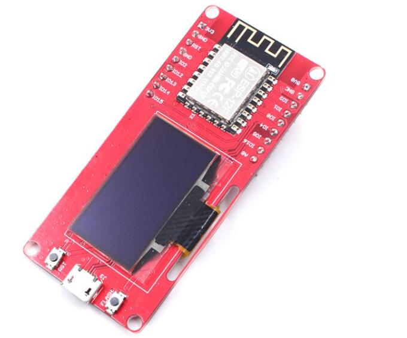
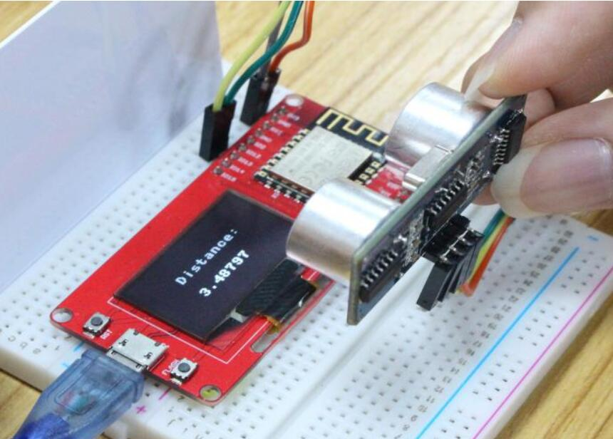
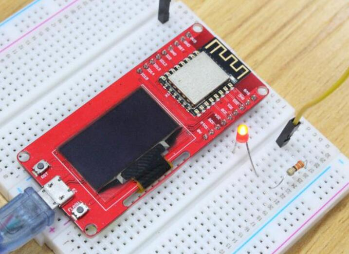

# Makepython-ESP8266

```c++
/*
Version:		V2.0
Author:			UNKOWN
Create Date:	UNKOWN
Note:
	2020/7/24	v2.0: Rebuid readme,add pic. By Vincent
*/
```

[toc]

# Introduce

Python is one of the most widely used, simple and easy-to-learn programming languages around. MicroPython is a lean implementation of the Python 3 programming language that has been pared down to run efficiently on microcontrollers.
MakePython ESP8266 is preloaded with MicroPython, simple and suitable for beginners to learn the basic programming with MicroPython, Of course, users can free to change it to make it work with other platforms such as Arduino/GCC.



- You can get one from: [Makepython-ESP8266](https://www.makerfabs.com/makepython-esp8266.html)

- Hardware and detailed instructions please visit Wiki page:  [Makepython-ESP8266 Wiki](https://wiki.makerfabs.com/MaESP_ESP8266_OLED.html)

# Related Test

Visit the wiki for details.

- Ultrasonic Ranging.



- Web Server Control LED


